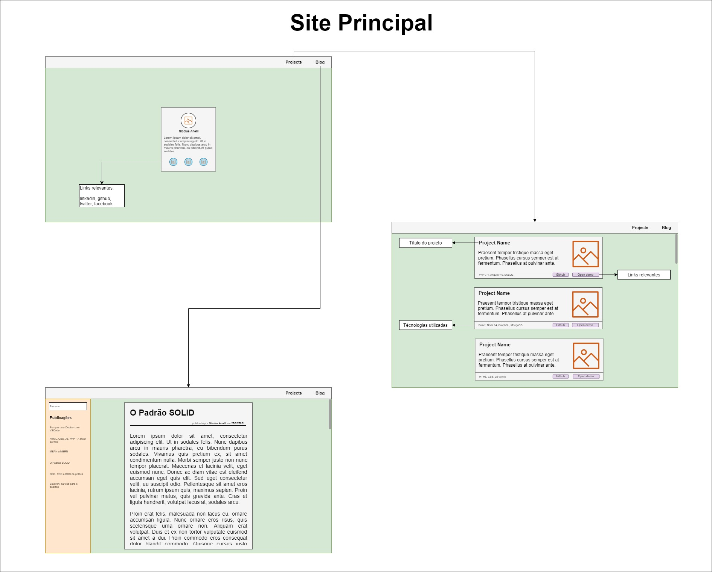
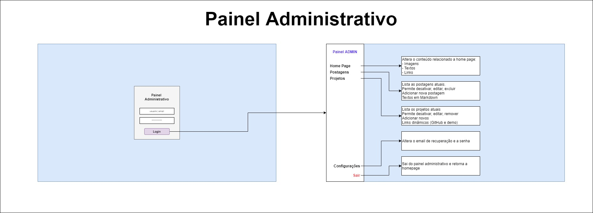

# Documentação

O diagrama do protótipo desse projeto pode ser encontrado em: [draw.io](https://app.diagrams.net/#G1O4qk5Gn_U5tY-_QElEmTPN7BLe4y_kDI).

## Site principal

O site principal seguirá o seguinte modelo:

É importante notar que a página inicial é uma página apenas com os dados básicos de contato e imagem.
Haverá um menu com links para os projetos e para o blog de postagens.

Os projetos serão listados contendo o titulo do projeto, descrição, imagem, técnologias relacionadas, e links relacionados.

O blog irá exibir a postagem mais recente, e listará a esquerda as postagens por ordem de publicação, sendo as mais recentes acima.

## Painel administrativo

O painel administrativo seguirá o seguinte modelo:

Para acessar o painel será necessário fazer login utilizando o login|email (a definir), e senha.

Ao acessar o painel é possível alterar dados exibidos na página principal, bem como imagens e os links.

Também será possível listar os projetos, e:

- Desativar: oculta no site principal, mas não excluir
- Reativar: volta a exibir no site principal
- Editar, excluir, cadastro um novo

As postagens seguem a mesma lógica dos projetos.

Também será possível alterar dados de login do painel, e eventuais configurações necessárias.